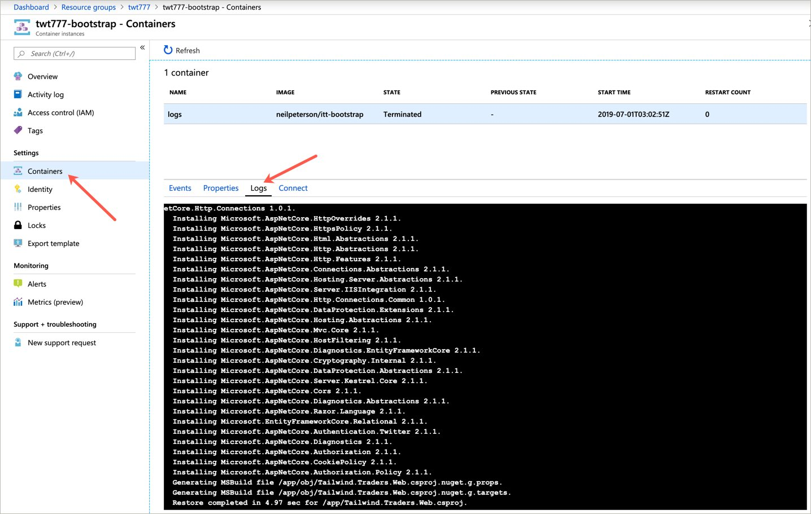

# Tailwind Traders Reference Deployment

This sample deploys the Tailwind Traders application across Azure services such as Azure Database for PostgreSQL, Azure Storage, and Azure Kubernetes Service.

In order to deploy this template, you need an Azure Service Principal. If needed, use the `az ad sp create-for-rbac` command to create the service principal. See [az ad sp create-for-rbac](https://docs.microsoft.com/en-us/cli/azure/ad/sp?WT.mc_id=none-github-nepeters&view=azure-cli-latest#az-ad-sp-create-for-rbac) for more information.

## Connect to deployment

To validate that the deployment has completed, select the Azure Container Instance.

Select **Containers** and **Logs**. One the container state has changed from **Running** to **Terminated**, the deployment automation has completed.

Scroll to the bottom of the logs and you can retrieve both the application URL and the command needed to connect to the Kubernetes cluster.

## Source Repositories

https://github.com/microsoft/TailwindTraders

https://github.com/neilpeterson/TailwindTraders-Backend

https://github.com/neilpeterson/TailwindTraders-Website